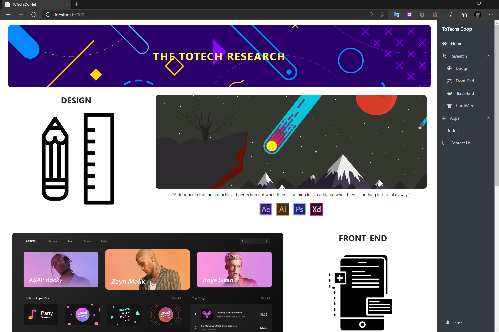
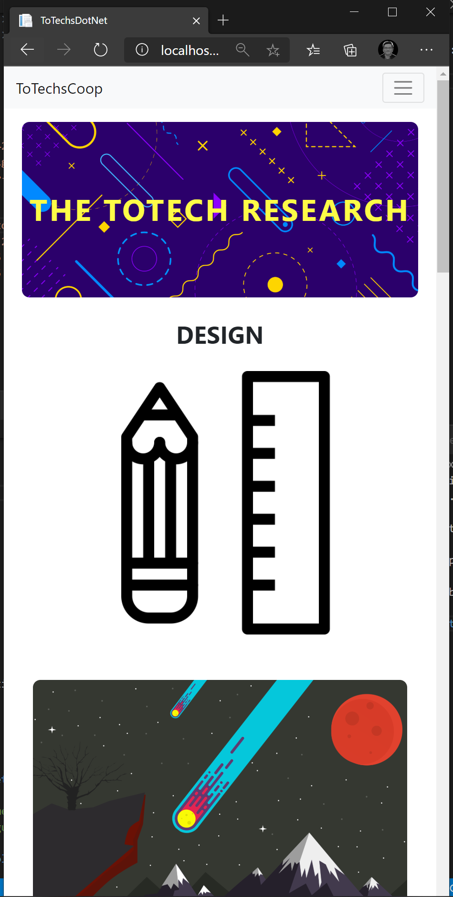
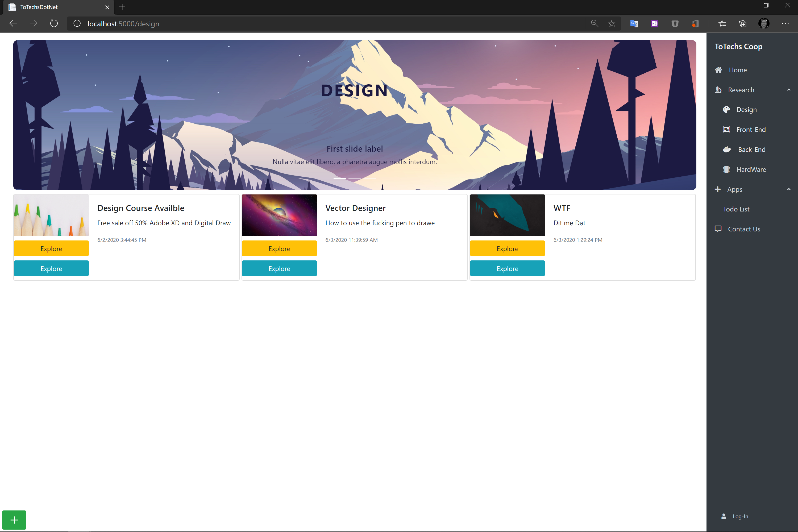
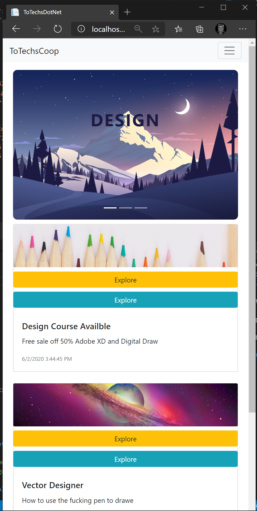
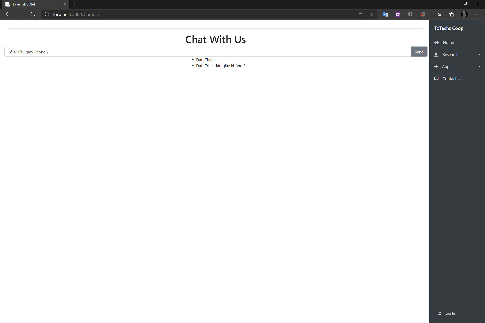
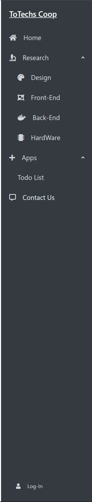

# Blazor-Server (MVC) 🟣🟪☁📱💻🖥🎨
 
 This is a project to let me discover about the the Blazor-Server Technology 👩‍💻. NOT THE BLAZOR WASM, these two are completely different Architecture ⚙, the reason why explain blazor-server will explain in the purpose section, right now just enjoy our time using this tech, while the architecture are different but their  development processes are the same (Well most of them)
# Purpose
 I HATE MVC, they are old and unscalable, but it's Micrsoft latest and commitest techs, I will have it a look. And I also recently got a lot of request. Gimme the web gimme the web fast I dont care about complex logic 🥺🥺. FINE !!! 😒 I think MVC and Blazor is a perfect concept for such small size businesses
 Things that going to fast in development progress 🚄🚄🚄🚄
 * Direct Entity Framework 
 * No need for ASP.NET Web API 🔌
 * Rely on BootStrap 4 less CSS 
 * Explore the new Blazorise Nuget Stuffs (Pretty fascinating 👍)
# Tools and Techs
  - [Blazor-Server] 🟣
  - [Blazories](https://blazorise.com/)  🎨
  - [Entity FrameWork Core](https://docs.microsoft.com/en-us/ef/core/)
  - [MSSQL] 🕋
  - [SignalR](https://docs.microsoft.com/en-us/aspnet/core/tutorials/signalr?view=aspnetcore-3.1&tabs=visual-studio) 🗨🗨🗨
	
# Demo
  - The Home Page doing BootStrap 4 grid-system
  
  - Responsive
  
  - The Design Page using Enitty to pull the Post data from the MSSQL where ``only`` type ``Design``
  
  - Responsive
  
  - Add Post for adding data to MSSQL using EF Core
  
  - RealTime chat using SignalR 
  
  - Blazorise NavBar
  